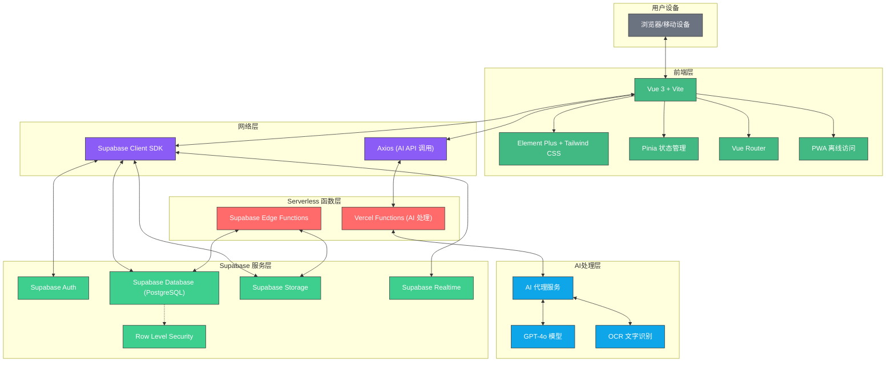
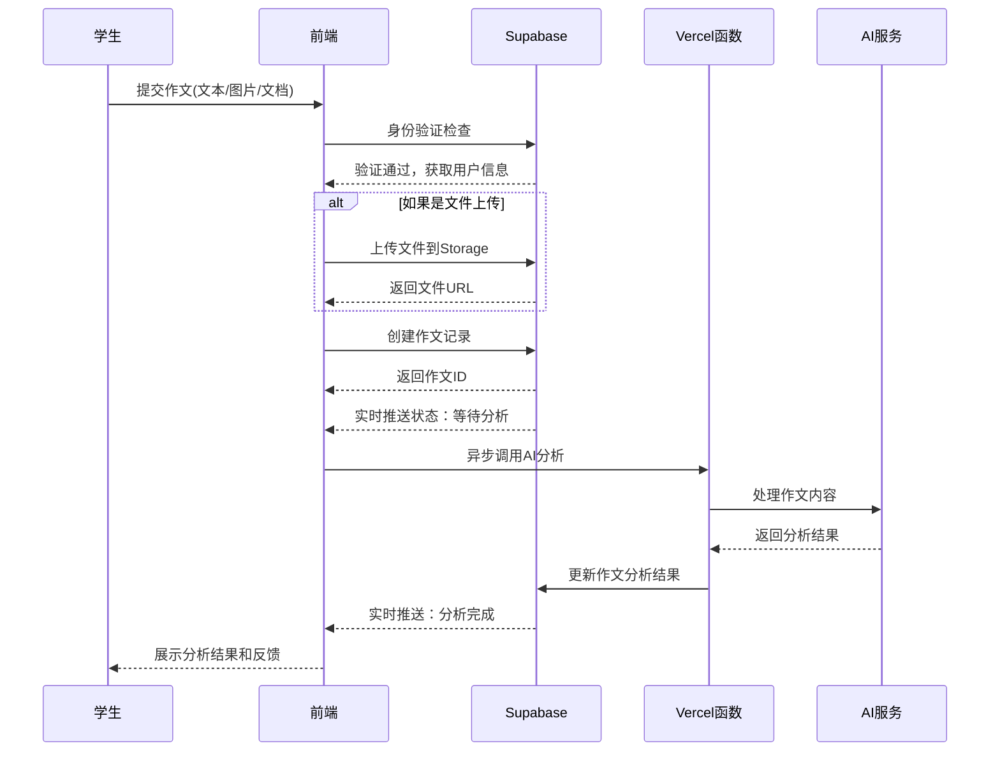
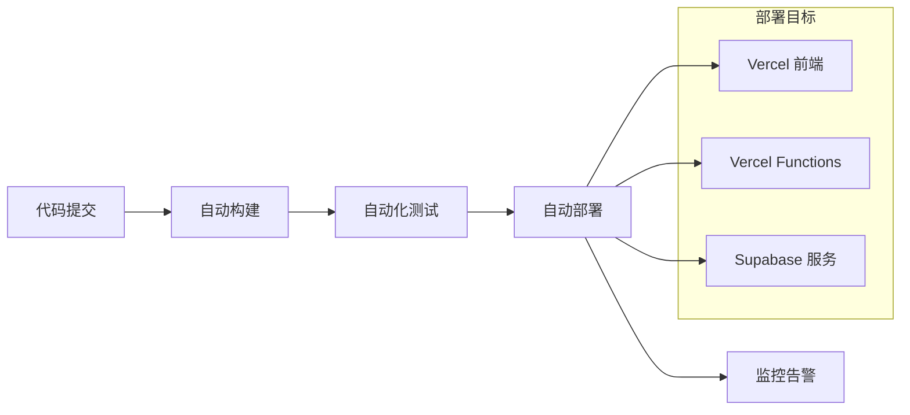
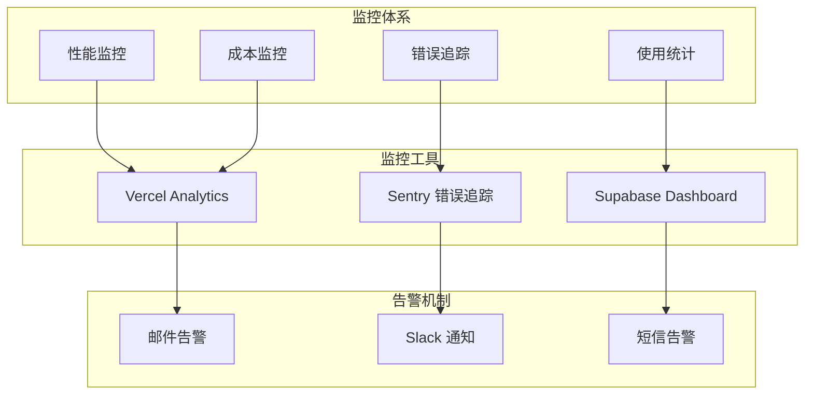

# 系统架构设计

## Writing Marker 技术架构概述

Writing Marker 采用现代化的 Serverless + BaaS 架构，通过 Supabase 提供的全栈服务大幅简化后端复杂度，确保系统的高可用性、可扩展性和快速开发迭代能力。

### 系统架构图

### 1.1 总体架构

- **前端主导**：Vue 3 前端直接连接 Supabase 处理大部分 CRUD 操作
- **Serverless 优先**：使用函数计算处理复杂业务逻辑
- **BaaS 集成**：Supabase 提供身份验证、数据库、存储和实时功能
- **AI 服务分离**：独立的 AI 处理函数专门处理模型调用

## 2. 前端技术栈详解

### 2.1 核心框架与库

- **Vue 3 (Composition API)** - 使用`<script setup>`语法提升开发效率与类型安全
- **Vite** - 新一代前端构建工具，提供极速热重载和优化的生产构建
- **Pinia** - 状态管理，替代Vuex，更好的TypeScript支持
- **Vue Router** - SPA路由管理

### 2.2 UI/UX技术

- **Element Plus** - 企业级UI组件库
- **Tailwind CSS** - 原子化CSS框架，加速UI开发
- **PostCSS** - CSS后处理器，支持嵌套语法等高级特性

### 2.3 体验增强技术

- **PWA支持** - 通过vite-plugin-pwa实现:
  - 离线访问能力
  - 添加到主屏幕
  - 后台自动更新
- **响应式设计** - 适配桌面与移动端
- **OCR集成** - 支持图片作文识别上传

### 2.4 数据层集成

- **Supabase Client SDK** - 统一的数据库操作和身份验证
  - 自动生成的 TypeScript 类型
  - 实时数据订阅
  - 自动缓存管理
- **Axios** - 用于 AI 服务 API 调用

## 3. Serverless 函数层详解

### 3.1 Supabase Edge Functions

- **数据库触发器函数** - 处理复杂的数据库操作
- **定时任务函数** - 处理批量数据处理和清理
- **Webhook处理函数** - 处理外部服务集成

### 3.2 Vercel Functions (AI 处理专用)

- **作文分析函数** - 调用 AI 模型进行作文评分
- **OCR处理函数** - 图片文字识别处理
- **内容推荐函数** - 基于用户数据生成个性化推荐

### 3.3 函数特性

- **自动扩展** - 根据请求量自动扩容
- **冷启动优化** - 通过预热和缓存减少延迟
- **环境隔离** - 开发、测试、生产环境完全隔离

## 4. Supabase 服务层详解

### 4.1 身份验证服务

- **Supabase Auth** - 统一身份验证服务
  - 邮箱/密码登录
  - 社交登录(Google, GitHub等)
  - Magic Link 无密码登录
  - JWT 令牌自动管理
  - 用户角色与权限管理

### 4.2 数据库服务

- **PostgreSQL** - 企业级关系型数据库
  - 自动 API 生成
  - 实时查询订阅
  - 全文搜索支持
  - JSON 字段支持
- **Row Level Security (RLS)** - 数据库层面的安全控制
  - 用户只能访问自己的数据
  - 角色基础的权限控制

### 4.3 文件存储服务

- **Supabase Storage** - 对象存储服务
  - 自动图片优化和格式转换
  - CDN 全球加速
  - 细粒度权限控制
  - 自动备份

### 4.4 实时功能

- **Supabase Realtime** - WebSocket 实时数据同步
  - 数据库变更实时推送
  - 多用户协作支持
  - 在线状态管理

## 5. AI技术集成方案

### 5.1 AI 服务架构

- **AIHubMix API集成** - 通过 Vercel Functions 调用 AI 大模型
- **GPT-4o模型** - 高级语言理解与反馈生成
- **异步处理** - AI 分析采用异步处理，提升用户体验

### 5.2 AI功能实现

- **作文评分算法** - 基于多维度分析(语法、词汇、结构、逻辑)
- **个性化反馈生成** - 不同错误类型对应不同反馈策略
- **学习资源推荐** - 基于错误模式的智能推荐系统
- **批量处理优化** - 支持多篇作文并行分析

## 6. 数据流与核心业务逻辑

### 6.1 作文提交与处理流程

### 6.2 数据模型设计

- **用户系统** - 基于 Supabase Auth，支持学生/教师/管理员角色
- **作文管理** - 版本控制、分析历史、学习进度跟踪
- **智能推荐** - 基于用户行为和错误模式的个性化推荐

## 7. 技术亮点与创新

### 7.1 架构优势

- **开发效率极高** - 前端直连 Supabase，大幅减少后端开发工作
- **实时功能开箱即用** - 无需自建 WebSocket 服务
- **自动扩展** - Serverless 架构自动处理流量波动
- **类型安全** - 全栈 TypeScript，Supabase 自动生成类型定义
- **安全性保障** - RLS 提供数据库层面的安全控制

### 7.2 性能优化

- **边缘计算** - Supabase Edge Functions 就近处理请求
- **智能缓存** - 多级缓存策略提升响应速度
- **异步处理** - AI 分析采用异步模式，避免阻塞用户操作
- **资源按需加载** - 代码分割和懒加载优化首屏性能

## 8. 部署与运维

### 8.1 部署架构

- **前端** - Vercel 静态部署，全球 CDN 加速
- **AI 函数** - Vercel Functions 自动部署
- **数据服务** - Supabase 托管服务，多区域备份
- **监控告警** - Vercel Analytics + Supabase Dashboard

### 8.2 CI/CD 流程

### 8.3 成本优化

- **按需付费** - Serverless 架构避免资源浪费
- **自动扩缩容** - 根据实际使用量自动调整资源
- **缓存策略** - 减少重复计算和数据库查询
- **资源共享** - Supabase 共享基础设施降低成本

## 9. 未来技术演进

### 9.1 短期规划 (3-6个月)

- **移动端 PWA 优化** - 提升移动端体验
- **AI 模型微调** - 基于用户反馈优化评分准确性
- **批改效率提升** - 并行处理和缓存优化

### 9.2 中长期规划 (6-12个月)

- **多语言支持** - 扩展到其他语种的作文批改
- **实时协作** - 教师学生实时协作批改功能
- **移动原生应用** - 基于 React Native 的原生应用
- **AI 助教功能** - 智能学习路径规划

### 9.3 扩展性考虑

- **多租户架构** - 支持教育机构独立部署
- **API 开放平台** - 为第三方开发者提供 API 接口
- **数据分析平台** - 教师端数据可视化和学习分析
- **国际化部署** - 利用 Supabase 的全球基础设施

## 10. 安全与合规

### 10.1 数据安全

- **数据加密** - 传输和存储全程加密
- **访问控制** - 基于 RLS 的细粒度权限控制
- **审计日志** - 完整的用户操作记录
- **数据备份** - 自动化多地备份策略

### 10.2 合规要求

- **GDPR 合规** - 用户数据隐私保护
- **教育行业标准** - 符合教育数据保护法规
- **SOC 2 认证** - Supabase 提供企业级安全保障

## 11. 监控与维护

### 11.1 系统监控

### 11.2 性能优化策略

- **代码分割** - 按需加载减少首屏时间
- **图片优化** - WebP 格式和自适应尺寸
- **缓存策略** - 多级缓存提升响应速度
- **CDN 加速** - 全球内容分发网络

### 11.3 维护流程

- **自动化部署** - Git 工作流驱动的 CI/CD
- **版本管理** - 语义化版本和回滚机制
- **定期更新** - 依赖包安全更新
- **性能调优** - 定期性能分析和优化

## 12. 团队协作与开发流程

### 12.1 开发工具链

- **IDE 配置** - VS Code 统一开发环境
- **代码规范** - ESLint + Prettier 自动格式化
- **类型检查** - TypeScript 严格模式
- **Git 工作流** - GitHub Flow 分支策略

### 12.2 协作工具

- **项目管理** - GitHub Projects 需求跟踪
- **文档协作** - 基于 Markdown 的文档管理
- **设计协作** - Figma 设计稿与开发同步
- **沟通工具** - Slack/Discord 实时沟通

### 12.3 质量保障

- **代码审查** - Pull Request 必须经过审查
- **自动化测试** - 单元测试 + 集成测试
- **端到端测试** - Playwright 自动化测试
- **性能测试** - Lighthouse CI 性能监控

## 13. 技术债务管理

### 13.1 技术选型原则

- **成熟稳定** - 选择经过市场验证的技术栈
- **社区活跃** - 确保长期技术支持
- **学习成本** - 平衡新技术收益与学习成本
- **迁移成本** - 考虑未来技术迁移的可能性

### 13.2 重构策略

- **渐进式重构** - 避免大规模重写
- **向后兼容** - 保证 API 稳定性
- **测试覆盖** - 重构前确保测试覆盖率
- **性能评估** - 重构后性能对比分析
