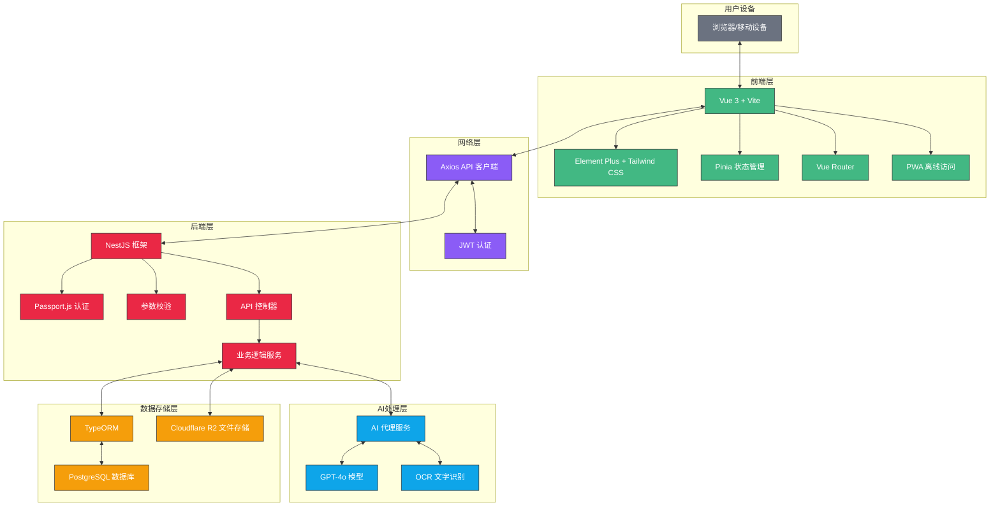
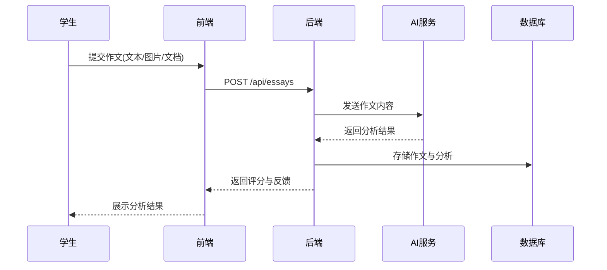

# Writing Marker 智能英语作文批改平台

## 技术路线文档 - 比赛路演宣讲版

## 1. 项目架构概览

### 1.1 总体架构

- **前后端分离**：Vue 3前端 + NestJS后端
- **AI引擎集成**：通过API代理层对接AIHubMix API
- **云原生部署**：前后端独立部署，支持Serverless架构

## 2. 前端技术栈详解

### 2.1 核心框架与库

- **Vue 3 (Composition API)** - 使用`<script setup>`语法提升开发效率与类型安全
- **Vite** - 新一代前端构建工具，提供极速热重载和优化的生产构建
- **Pinia** - 状态管理，替代Vuex，更好的TypeScript支持
- **Vue Router** - SPA路由管理

### 2.2 UI/UX技术

- **Element Plus** - 企业级UI组件库
- **Tailwind CSS** - 原子化CSS框架，加速UI开发
- **PostCSS** - CSS后处理器，支持嵌套语法等高级特性

### 2.3 体验增强技术

- **PWA支持** - 通过vite-plugin-pwa实现:
  - 离线访问能力
  - 添加到主屏幕
  - 后台自动更新
- **响应式设计** - 适配桌面与移动端
- **OCR集成** - 支持图片作文识别上传

### 2.4 网络与通信

- **Axios** - RESTful API通信
- **JWT认证** - 安全的身份验证

## 3. 后端技术栈详解

### 3.1 服务框架

- **NestJS 11.x** - 企业级Node.js框架
  - 模块化设计
  - 依赖注入
  - 装饰器驱动
  - TypeScript原生支持

### 3.2 数据存储与ORM

- **PostgreSQL** - 强大的关系型数据库
- **TypeORM** - 对象关系映射，类型安全的数据操作
- **Cloudflare R2** - 用于文件存储(作文原文、图片等)

### 3.3 安全与认证

- **Passport.js** - 认证中间件
- **JWT** - 无状态身份验证
- **bcrypt** - 密码安全哈希
- **class-validator** - 请求数据验证

### 3.4 部署与CI/CD

- **Serverless部署** - 支持Vercel/AWS部署
- **环境变量管理** - 敏感信息安全配置
- **自动化测试** - Jest单元测试与E2E测试

## 4. AI技术集成方案

### 4.1 AI引擎对接

- **AIHubMix API集成** - 通过专用代理服务调用AI大模型
- **GPT-4o模型** - 高级语言理解与反馈生成
- **API密钥安全管理** - 环境变量隔离

### 4.2 AI功能实现

- **作文评分算法** - 基于多维度分析(语法、词汇、结构、逻辑)
- **个性化反馈生成** - 不同错误类型对应不同反馈策略
- **学习资源推荐** - 基于错误模式的智能推荐系统

## 5. 数据流与核心业务逻辑

### 5.1 作文提交与处理流程

### 5.2 数据模型设计

- **用户管理** - 学生/教师/管理员角色设计
- **作文管理** - 版本历史、批改记录、评分跟踪
- **内容推荐** - 基于用户错误模式的个性化推荐

## 6. 技术亮点与创新

### 6.1 技术亮点

- **全栈TypeScript** - 端到端类型安全
- **高性能与可扩展性** - 前后端分离架构，支持水平扩展
- **离线功能支持** - PWA技术实现无网络访问
- **多格式作文处理** - OCR+文档解析统一处理流程

### 6.2 工程创新

- **微服务就绪** - 模块化设计便于未来拆分服务
- **API版本控制** - 支持API演进与向后兼容
- **监控与日志** - 完善的应用状态监控系统

## 7. 未来技术演进路线

### 7.1 短期技术规划 (6个月)

- **AI模型优化** - 基于用户反馈改进评分算法
- **移动端原生应用** - 开发基于Flutter的跨平台原生应用
- **数据分析仪表板** - 增强教师端数据可视化能力

### 7.2 中长期技术蓝图 (1-2年)

- **实时协作批改** - 支持教师与AI协作批改
- **语音反馈功能** - 增加TTS技术提供口头反馈
- **多语言支持** - 扩展至其他语种作文批改
- **AI个性化学习路径** - 基于学习历史的智能学习规划

## 8. 部署与扩展性

### 8.1 部署架构

- **前端部署** - Vercel/Netlify静态部署
- **后端部署** - Serverless函数部署/容器化部署
- **数据库部署** - 托管PostgreSQL服务
- **监控与告警** - 基于Prometheus+Grafana

### 8.2 扩展性设计

- **负载均衡** - 支持流量增长的水平扩展
- **缓存策略** - 多级缓存提升性能
- **多租户架构** - 支持教育机构定制化部署

本文档由 **Writing Marker** 颁发 [CC BY-NC-SA 4.0 License](https://creativecommons.org/licenses/by-nc-sa/4.0/) 许可。
